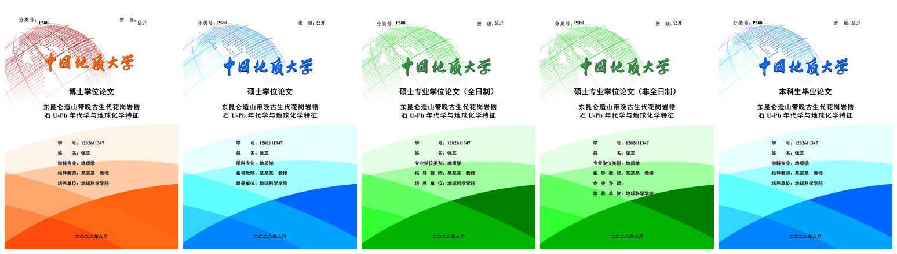

# CUGThesis

中国地质大学（武汉）研究生学位论文 **XeLaTeX** 模板，依据研究生院 **2025 年 5 月版**
《研究生学位论文写作规范》逐条校准（含附件 1–12 的全部实物样式）。



> 左起：博士、硕士、硕士专业学位（全日制）、硕士专业学位（非全日制）、本科。
> 完整版见 [`cover-options.pdf`](cover-options.pdf)（一页一种，便于挑选）。

---

## ⚠️ 免责声明

1. 本模板是**个人维护的开源排版辅助工具，并非学校官方发布**，与研究生院及任何学院无隶属或授权关系。
2. 一切格式要求**以中国地质大学（武汉）研究生院发布的最新版《研究生学位论文写作规范》原文，以及所在学院、导师的具体要求为准**。本模板依据的是 **2025 年 5 月版**规范；该规范日后若再修订，本模板可能未能同步。
3. 本模板**不保证**排版结果必然通过学院的格式审查。**提交前请务必以规范原文逐项人工核对**，因格式不符合要求而产生的后果由使用者自行承担。
4. 论文封面采用学校统一版式，其著作权归中国地质大学（武汉）所有，本模板对其仅作排版辅助使用。
5. 本模板采用 **GPL-3.0** 许可，原始著作权归原作者 **王震宇**（zhenyuwang94@gmail.com）所有。本仓库是在其 2018 版基础上的格式修订。

---

## 快速开始

### 最小可用文档

```latex
\documentclass[master]{cugthesis}
% 学位类型：doctor / master / masterprofulltime / masterpronofulltime / bachelor

\cugthesistitle{中文题目}{English Title}
\cugthesisauthor{姓名}{Name}
\studentid{1202611347}
\cugthesismajor{学科专业}{Major}
\cugthesisteacher{导师姓名\quad 教授}{Prof.\ XXX}
\educatingunit{培养单位}
\cugthesisdate{2026}{6}
\cugclassnumber{P5}                 % 分类号（封面用，查《中国图书馆分类法》）
\cugsecretlevel{公开}               % 密级（封面用）

\cugabstract{中文摘要}{English abstract}
\cugkeywords{关键词一; 关键词二}{Keyword1; Keyword2}

\begin{document}
    \makefrontpages                 % 一次性生成全部前置页
    \chapter{绪论}
    ……
    \backmatter
    \cugthesisbib{tex}              % 参考文献
    \cugthesisacknowledgements      % 致谢
    \appendix
    \chapter{附录}
\end{document}
```

`\makefrontpages` 一行生成：封面 → 中文题名页 → 英文题名页 → 原创性声明 → 导师承诺书 →
使用授权书 → 作者简历 → 答辩委员会名单 → 中文摘要 → Abstract → 目录 → 图清单 → 表清单。

### 编译

```bash
xelatex -shell-escape 你的文件.tex
bibtex  你的文件
xelatex -shell-escape 你的文件.tex
xelatex -shell-escape 你的文件.tex
```

Windows 下也可以双击 `build.bat`（默认编译 `demo.tex`），或 `build.bat sample` 编译指定文件。

---

## 目录结构

| 文件 | 说明 |
|---|---|
| `cugthesis.cls` | **文档类主体**：版式参数、封面、全部前置页、目录格式、页眉页脚 |
| `cugthesisfont.sty` | 字体探测（含回退链与缺失报错）与中文字号命令 |
| `ttools.sty` | 小工具：`\tilcode` 行内代码、缺图时的占位框 `\cugdemoimage` |
| `tcode.sty` | 代码环境。**默认降级为 `fancyvrb`**，需要高亮时 `\usepackage[minted]{tcode}` |
| `authorcv.tex` | 作者简历内容（由 `\makeauthorcv` 载入） |
| `gbt7714-2005.bst`<br>`gbt7714-2005-sec.bst` | 参考文献样式，后者对应类选项 `bibsec` |
| `tex.bib` / `sample.bib` | 示例文献库 |
| `example.tex` | **最小骨架**，只有必需结构 |
| `sample.tex` | **地质学完整示例**（东昆仑造山带花岗岩锆石 U–Pb 年代学），含三线表、横向大图、公式、交叉引用 |
| `demo.tex` | **模板说明书**，逐个介绍命令与用法 |
| `cover/` | 封面底图（供挑选与替换） |
| `figs/` | `sample.tex` 用的插图（由 matplotlib 生成） |
| `coverpreview/` | 五种封面各自的编译源码（`cov-*.tex`） |
| `cover-options.pdf` | 五种封面各一页，用于挑选 |
| `docs/` | README 用图 |
| `build.bat` / `Makefile` | 编译脚本 |
| `.github/workflows/build.yml` | CI：push 时自动编译三个示例文档并上传 PDF |

> `.workbuddy/` 是本地工具目录（含审阅过程中的验证脚本与工作记录），**不随仓库分发**。

---

## 类选项

| 选项 | 说明 |
|---|---|
| `doctor` | 博士学位论文 |
| `master` | 硕士学位论文（默认） |
| `masterprofulltime` | 硕士专业学位论文（全日制） |
| `masterpronofulltime` | 硕士专业学位论文（非全日制） |
| `equaldoctor` | 同等学力博士学位论文 |
| `equalmaster` | 同等学力硕士学位论文 |
| `bachelor` | 本科生毕业论文 |
| `bibsec` | 参考文献使用 `gbt7714-2005-sec` 样式 |
| `nocover` | 不生成中文封面 |
| `frontmatterhead` | 前置部分也显示页眉文字（默认关闭，见下） |

学位类型的六种写法与规范 2.4 的页眉「中国地质大学□」逐字对应：博士学位论文 /
同等学力博士学位论文 / 硕士学位论文 / 硕士专业学位论文（全日制）/
硕士专业学位论文（非全日制）/ 同等学力硕士学位论文。

> 附件 12 只给了博士、硕士、专硕（全日制/非全日制）四种封面底图。底图本身是通用版式
> ——只有「分类号：」「密　级：」和校名，**不含学位类型文字**——所以**本科**与
> **同等学力**都复用同一版式的底图（本科用蓝色 `cover/bachelor.jpg`；同等学力博士、
> 硕士分别复用 `cover/doctor.jpg`、`cover/master.jpg`）。拿到学校专用底图后替换即可。

---

## 论文信息命令

| 命令 | 说明 |
|---|---|
| `\cugthesistitle{中文}{英文}` | 论文题目 |
| `\cugthesisauthor{中文}{英文}` | 作者姓名 |
| `\studentid{学号}` | 学号（本科为「本科生学号」） |
| `\cugthesismajor{中文}{英文}` | 学科专业 / 专业学位类别 |
| `\cugthesisteacher{中文}{英文}` | 指导教师 |
| `\cugthesisteachertwo{中文}{英文}` | 第二导师（可选） |
| `\educatingunit{培养单位}` | 培养单位 |
| `\cugthesisdate{年}{月}` | 日期，自动转成汉字（如 `\cugthesisdate{2026}{6}` → 二〇二六年六月） |
| `\cugclassnumber{P5}` | 分类号（封面左上） |
| `\cugsecretlevel{公开}` | 密级（封面右上） |
| `\cugabstract{中文}{英文}` | 中英文摘要 |
| `\cugkeywords{中文}{英文}` | 中英文关键词 |
| `\cugcommitteemember{职务}{姓名}{职称}{单位}` | 答辩委员会成员，可多次调用 |
| `\cugbookspine{厚度}` | 生成书脊样式页（规范 3.3），参数是书脊实际厚度，如 `\cugbookspine{10.7mm}` |
| `\cugfontsreport` | 在正文任意处插一次，编译后打印实际用到的字体 |
| `\cugthesisversion` | 输出版本号，如 `CUGThesis v0.2（2026/09/18）` |

作者简历在 `authorcv.tex` 里写，用 `\cugauthorcvsection{标题}` 起小节、
`\cugauthorcvinfoitem{起}{止}{说明}` 写一行经历。

### 书脊怎么算厚度

规范 3.3：**书脊用仿宋**，上方写题目、中间写作者姓名、下方写「中国地质大学（武汉）」。

```
厚度 ≈ 页数 ÷ 2 × 每张纸厚 + 封面卡纸厚
      · 70 g 纸约 0.08 mm／张，80 g 约 0.10 mm，100 g 约 0.12 mm
      · 例：正文 200 页 → 200 ÷ 2 × 0.10 + 0.7 ≈ 10.7 mm
```

拿不准就直接量一沓内页（量 100 张再除以 100 更准）。生成的是一页 A4，
中间一条 280 mm 长的书脊，**沿虚线裁下**即可，也可以把该页整页交印厂。

> 仿宋会自动探测 `FangSong`（系统仿宋）→ `Adobe Fangsong Std` → `STFangsong`；
> 都没有时退回宋体并**明确警告**，不会静默换字体。

---

## 编译环境

| 项目 | 要求 |
|---|---|
| 引擎 | **XeLaTeX**（必须，需中文排版支持） |
| 发行版 | TeX Live 2023 及以上 / MiKTeX |
| 中文 | 宋体 + 黑体 |
| 西文 | Times New Roman |
| 可选 | Python + Pygments —— 仅 `\usepackage[minted]{tcode}` 时需要 |

### 字体策略

模板按「**系统字体 → 开源等价字体**」顺序自动探测，全部缺失时**直接报错**，绝不静默换字体：

- 中文正文（宋体）：`SimSun` → `Source Han Serif SC`（思源宋体）→ `Noto Serif CJK SC` → `FandolSong`
- 中文标题（黑体）：`SimHei` → `Source Han Sans SC` → `Noto Sans CJK SC` → `FandolHei`
- 西文（Times New Roman）：`Times New Roman` → `TeX Gyre Termes` → `Liberation Serif`

后两个西文字体与 Times New Roman **公制兼容**（字宽字高一致），在装不了 Times New Roman 的
服务器 / Overleaf 上可保证版面不变；思源系列为 SIL OFL 授权，可免费商用。

### 各平台

**Windows**：`build.bat` / `build.bat sample`

**Overleaf**：上传本目录全部文件 → Menu → Compiler 选 **XeLaTeX** → Main document 选主文件 → Recompile

> `-shell-escape` 只有 `minted` 需要，默认的 `fancyvrb` 不需要。

---

## 格式说明（依 2025 版规范）

### 版式参数

| 项目 | 规范要求 | 本模板实现 |
|---|---|---|
| 中文字体 | 宋体 / 黑体 | 显式指定 + 回退链 + 缺失报错 |
| 西文字体 | Times New Roman 12 磅 | 同上（公制兼容替代） |
| 正文行距 | **固定值 20 磅** | 固定 20 磅（重定义 `\normalsize`，并复位 ctex 的 1.3 倍行距） |
| 摘要标题 | 黑体 18 磅（小二） | 18 磅 |
| 图表题注 | 五号 10.5 磅宋体居中 | 10.5 磅，序号与题名间空 1 汉字符 |
| 页眉 | 距纸边 2.5cm | `headheight + headsep = top − 2.5cm` |
| 目录 | 章四号、节小四，缩进 18 / 36 磅 | 同 |
| 图表清单 | 标题 18 磅，条目小四 | 同（清单名「图清单」「表清单」） |
| 声明类页面 | 四号 14 磅 + 2 / 2 / 1.5 倍行距 | 同（落款缩进另按附件 189 / 147 / 203 磅） |
| 题名页 | 顶部 4 列等宽表格；标签列宽 114.8 / 122.8 磅 | 同 |

### 印刷与装订（规范 3.10）

规范原文：

> 论文自中文摘要起双面印刷，之前部分单面印刷。如果论文因页码过少而不能印刷书脊时，可以单面印刷。
> 根据论文存档要求，论文必须用线装或热胶装订，不能使用金属钉装订。

模板据此前置部分（封面 → 题名页 → 英文题名页 → 声明 / 承诺 / 授权 → 作者简历 →
答辩委员会名单）**不插空白页**，从中文摘要起才按双面对齐（保证每章从奇数页开始）。

**实测效果**（以 `sample.tex` 为例）：改前 43 页含 5 张空白页，改后 **38 页**，前置部分完全连续。

具体做法两条：

1. 前置部分的 `\cleardoublepage` 全部换成 `\clearpage`；
2. **不用 `titlepage` 环境** —— 它在双面模式下以 `\cleardoublepage` 开头，
   会在封面与题名页之间塞一张空白页（这一条最隐蔽，光看源码不容易发现）。

### 附件里这些内容**不属于论文**，模板一律不实现

学校给的附件文档（`2025修改：附件1-11.doc`）里混着若干**它自己**的编辑痕迹与说明文字，
照搬进论文会闹笑话。逐项记录在此，便于核对：

| 附件里的东西 | 出处 | 模板 |
|---|---|---|
| **「附件 X：……」标识**（共 11 处，如「附件1：中文题名页」） | 每页左上角 | 不出现 |
| **红色「提示信息」文本框**（共 8 处，如「提示信息：本页式样适用于全体博士研究生」） | 各页左上 | 不出现 |
| **附件文档自身页眉里的「附录」二字** | 该文档的 `word/header1.xml`（Word 页眉残留） | 不出现 |
| **「（双面印制）」「奇数页式样／偶数页式样」** | 附件 10「页眉式样」页的说明文字 | 不出现 |

核验方式：对 `demo.pdf` / `sample.pdf` / `example.pdf` / `cover-options.pdf` 全文检索
「附件」「提示信息」「附录」「式样」，命中的应当**只有论文本身的附录章节**。
脚本见 `.workbuddy/extract/check_residue.py`（或技能库里的 `check_annex_residue.py`）。

模板页眉严格按规范 2.4 只印两样：奇数页「中国地质大学□」、偶数页「作者姓名：论文题目」，
页码在外侧。**附录章节的页眉同样如此，不会出现「附录」字样**。

### 与规范正文冲突时：以附件为准

学校规范的正文与附件之间存在若干矛盾。**本模板统一以附件（实物样式）为准**：

| 事项 | 规范正文 | 附件 | 模板采用 |
|---|---|---|---|
| 图表编号分隔符 | 2.5.1「图3.2」（点号） | 附件 9「图2-1」（连字符） | **图2-1** |
| 专硕标签 | 3.5 表「Type」 | 附件 1「专业学位类别」、附件 2「Category」 | **专业学位类别 / Professional Degree Category** |
| 作者简介页标题 | 1.6「作者简介」 | 附件 6「作者简历」 | **作者简历** |
| 使用授权书标题 | — | 附件 5 无「研究生」三字 | **学位论文使用授权书** |
| 题名页字段名 | — | 附件 1「姓　名：」字间留空 | **字间留空、冒号对齐** |
| 英文题名页冒号 | — | 附件 2 全角「Ph.D. Candidate：」 | **全角冒号** |
| 目录标题 | — | 附件 8「目  录」 | **目\quad 录** |
| 声明页落款 | — | 附件 3/4/5「日  期：」 | **日\quad 期：** |

### 一处例外：日期里年份的零

附件用的是 `U+25CB「○」`，但该字符在宋体中字形又小又靠下，印出来像句号；
模板改用 `U+3007「〇」`（中文的数字零，宋体里是全角居中的标准字形）。
若要严格复现附件的码点，见 `cugthesis.cls` 中 `\cugthesisdate` 上方的注释。

### 仍需向学院确认的两点

1. 规范 2.4 说「页眉从第一章开始」，但附件 10 只给了正文页眉式样 —— 前置部分（摘要、目录）
   是否允许出现页眉？模板按 2.4 的字面执行（不印页眉文字、只留外侧页码）；
   若学院要求保留，加载类时加 `frontmatterhead` 选项即可恢复。
2. 参考文献：规范正文仍引用 **GB/T 7714-2005**（该标准已被 2015 版替代），模板只提供 2005 版的 `.bst`。

### 横向页面与大图

`sample.tex` 里用 `pdflscape` 的 `landscape` 环境实现：

```latex
\usepackage{pdflscape}          % 导言区

\begin{landscape}
\thispagestyle{cuglandscape}    % 模板提供的样式：只印外侧页码
\begin{center}
    \vspace*{\fill}
    \includegraphics[width=.94\linewidth]{figs/fig_wide_summary.png}
    \vspace{1.2em}
    \captionof{figure}{图题}
    \label{fig:wide}
    \vspace*{\fill}
\end{center}
\end{landscape}
```

两点经验：

- 横向页被旋转 90° 后**页眉文字会落到可视范围之外**，所以用 `cuglandscape` 页样式（只保留页码）。
- 用 `center` + `\captionof`，**不要用 `figure` 浮动体** —— 浮动体的图会缩在横向页顶部，
  `\vspace*{\fill}` 才能把它压到垂直居中。

---

## 示例文档

| 文件 | 用途 |
|---|---|
| `example.tex` | 最小骨架，最快上手 |
| `sample.tex` | 地质学完整示例，可直接替换内容使用 |
| `demo.tex` | 模板说明书 |
| `cover-options.pdf` | 五种封面样式对照 |

---

## 修订记录

### 2026：依 2025 年 5 月版规范全面校准

原版发布于 2018 年（依据 2015 年版规范），最后编译于 2019-12。本轮修订分两步：

**第一步（读规范正文与附件文本）**——统一字体（原来西文实际是 Latin Modern、中文随环境变化）、
正文行距改为固定 20 磅、摘要标题 18 磅、图表题注 10.5 磅、页眉位置修正、新增中文封面与
答辩委员会名单两页、插图缺图时不再直接编译失败。

**第二步（解析附件 OOXML 逐页复核）**——把 `.doc` 导出为 `.docx` 后直接读 `word/document.xml`，
拿到每页每个 run 的字号、对齐、行距、缩进与表格列宽，又修正了 8 处：

| 项目 | 修订前 | 修订后（附件实测） |
|---|---|---|
| 声明页正文 | 小四 12 磅 + 固定 20 磅 | **四号 14 磅 + 2 倍行距**（附件 3/4） |
| 使用授权书正文 | 同上 | **四号 14 磅 + 1.5 倍行距**（附件 5） |
| 声明页落款 | `flushright` 靠右 | **附件实测缩进**：189 / 147 / 203 磅 |
| 题名页顶部 | `\hfill` 把学号推到纸边 | **4 列等宽表格**（附件 1，各列 109.3 磅） |
| 题名页标签列宽 | 4 / 6 个汉字符 | **114.8 / 122.8 磅**（附件 1 实测） |
| 目录层级缩进 | 1 / 2 汉字符 | **18 / 36 磅**（附件 8 实测） |
| 清单标题字号 | 套用章标题（16 磅黑体） | **18 磅**（附件 9） |
| 答辩名单标题 / 名单 | 三号 16 / 四号 14 | **二号 22 / 三号 16**（附件 7） |

此外还改了：使用授权书标题去掉多余的「研究生」三字、承诺书签字栏「指导老师」→「指导教师」、
专硕标签改用附件的「专业学位类别 / Professional Degree Category」、示例文档的后置部分顺序改为
参考文献 → 致谢 → 附录、`Makefile` 不再依赖 macOS 的 `open` 命令。

本轮新增**本科封面**（`cover/bachelor.jpg`）与**封面样式对照** `cover-options.pdf`。

> 附件 12 只给了博士、硕士、专硕（全日制 / 非全日制）四种底图。底图本身是通用版式 ——
> 只有「分类号：」「密　级：」和校名，**不含学位类型文字** —— 所以本科沿用同一版式的蓝色底图。
> 若学院另有规定，替换该图片、并改 `cugthesis.cls` 里 `\ifcug@bachelor` 分支的一行即可。

---

## 许可与致谢

- 原始模板：**王震宇** &lt;zhenyuwang94@gmail.com&gt;（2018 版）
- 许可：**GPL-3.0**，见 [`LICENSE`](LICENSE)
- 上游仓库：[Timozer/CUGThesis](https://github.com/Timozer/CUGThesis)
